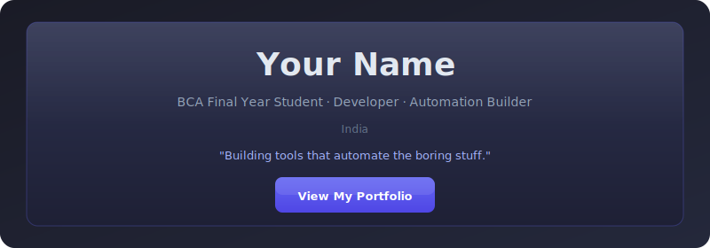
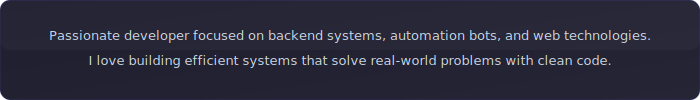
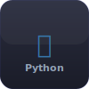
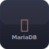
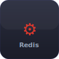
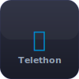
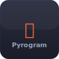
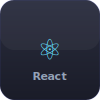
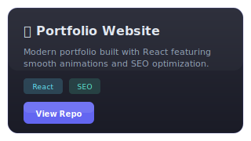
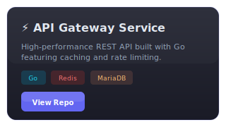

#

<!-- HERO BANNER -->
<p align="center">
  <a href="https://yourportfolio.com">
    
  </a>
</p>

---

## 👨‍💻 About Me

<p align="center">
  
</p>

---

## 🛠 Tech Stack

<p align="center">
  
  &nbsp;&nbsp;
  
  &nbsp;&nbsp;
  
  &nbsp;&nbsp;
  
  &nbsp;&nbsp;
  
</p>

<p align="center">
  
  &nbsp;&nbsp;
  
  &nbsp;&nbsp;
  
  &nbsp;&nbsp;
  
  &nbsp;&nbsp;
  
</p>

---

## 🚀 Featured Projects

<p align="center">
  <a href="https://github.com/yourusername/project1">
    
  </a>
  &nbsp;&nbsp;
  <a href="https://github.com/yourusername/project2">
    
  </a>
</p>

<p align="center">
  <a href="https://github.com/yourusername/project3">
    
  </a>
</p>

---

## 📊 GitHub Stats

<p align="center">
  
</p>

<p align="center">
  
  &nbsp;
  
</p>

<p align="center">
  
</p>

<p align="center">
  
</p>

---

## 🐍 Contribution Snake

<p align="center">
  <picture>
    <source media="(prefers-color-scheme: dark)" srcset="https://raw.githubusercontent.com/yourusername/yourusername/output/github-contribution-grid-snake-dark.svg">
    <source media="(prefers-color-scheme: light)" srcset="https://raw.githubusercontent.com/yourusername/yourusername/output/github-contribution-grid-snake.svg">
    
  </picture>
</p>

<details>
<summary>🔧 Setup Snake Animation (Click to expand)</summary>

Create `.github/workflows/snake.yml`:

```yaml
name: Generate Snake

on:
  schedule:
    - cron: "0 0 * * *"
  workflow_dispatch:

jobs:
  build:
    runs-on: ubuntu-latest
    steps:
      - uses: Platane/snk@v3
        with:
          github_user_name: yourusername
          outputs: |
            dist/github-contribution-grid-snake.svg
            dist/github-contribution-grid-snake-dark.svg?palette=github-dark

      - uses: crazy-max/ghaction-github-pages@v3.1.0
        with:
          target_branch: output
          build_dir: dist
        env:
          GITHUB_TOKEN: ${{ secrets.GITHUB_TOKEN }}
```

</details>

---

## 📫 Connect With Me

<p align="center">
  <a href="https://github.com/yourusername">
    
  </a>
  &nbsp;&nbsp;
  <a href="https://linkedin.com/in/yourusername">
    
  </a>
  &nbsp;&nbsp;
  <a href="mailto:your@email.com">
    
  </a>
  &nbsp;&nbsp;
  <a href="https://yourportfolio.com">
    
  </a>
</p>

---

<p align="center">
  
</p>

<p align="center">
  
</p>

---

<p align="center">
  <sub>Crafted with precision</sub>
</p>
